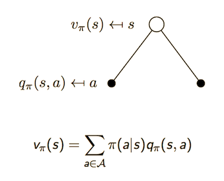
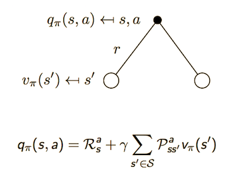

# Markov Decision Processes

- MDPs are defined by:

  - Set of states S

  - Set of actions A

  - Transition Function $P(s' | s,a)$ defines all such transitions from all states s(row) to all successor states s'(column):
    $$
    P = \begin{bmatrix}
        P_{11} & \cdots & P_{1n} \\
        \vdots & \ddots & \vdots \\
        P_{n1} & \cdots & P_{nn} \\
        \end{bmatrix}
    $$

  - Reward Function $R(s, a, s')$

  - Start State $s_0$ or distribution of start state probabilities

  - Discount Factor $\gamma$

  - Horizon $H$ (how long we observe and act)

- MDPs describe a fully observable environment for RL

- Each state by itself can completely characterize the process

- Even partially observable problems can be converted to MDPs

- **Markov Property**

  - A state is Markov iff  $P[S_{t+1} | S_t] = P[S_{t+1} | S+1, \cdots, S_t]$, i.e. the future is independent of the past given the present. The state is a sufficient stastistic of the future

  - For a Markov state s and successor state s', we can define a state transition probability $P_{ss'}$:
    $$
    P_{ss'} = \mathbb{P}[S_{t+1}=s' | S_{t}=s]
    $$

- **Markov Process/Markov Chain:** A memory-less random process(sequence of random states $S_1, S_2, \cdots $), with the Markov Property

  - A tuple $\langle S, P \rangle$
    - $S$ is a finite set of states
    - $P$ is the state transition probability matrix

# Markov Reward Process:

- A markov chain with values

- Formally, it is a tuple $\langle S, P, R, \gamma \rangle$
  - $S$ is a finite set of states
  - $P$ is the state transition probability matrix
  - $R$ is the reward function, $R_s = \mathbb{E}[R_{t+1} | S_{t}=s]$
  - $\gamma$ is the discount factor, $\gamma \in [0, 1]$. 0 is myopic evaluation, 1 is far-sighted evaluation

- We define the following things about MRPs

- **Return($G_t$):** Total discounted reward from time step t

  - $G_t = R_{t+1} + \gamma R_{t+2} + \gamma^2R_{t+3} + \cdots = \sum_{k=0}^\infty\gamma^kR_{t+k+1}$
  - $\gamma$ acknowledges the value of future rewards at time step t

- **Value Function: $v(s)$**

  - The state value function of an MRP is the expected return starting from state s
    $$
    v(s) = \mathbb{E}[G_t | S_t=s]
    $$

  - Given the current state, what is the expected return from all possible future time steps from this state

- **Bellman Equation**

  - The value function can be broken up into two parts:

    - immediate reward $R_{t+1}$

    - discounted value of successor state $\gamma v(S_{t+1})$
      $$
      \begin{align}
      v(s) & = \mathbb{E}[G_t | S_t=s] \\
      & = \mathbb{E}[R_{t+1} + \gamma R_{t+2} + \gamma^2R_{t+3} + \cdots | S_t=s] \\
      & = \mathbb{E}[R_{t+1} + \gamma(R_{t+2} + \gamma R_{t+3} + \cdots) | S_t=s] \\
      & = \mathbb{E}[R_{t+1} + \gamma G_{t+1} | S_t=s] \\
      & = \mathbb{E}[R_{t+1} + \gamma v(s+1) | S_t=s]
      \end{align}
      $$

    - The value of the current state is equal to the sum of the expected immediate reward and the discounted value of the next state

    - $v(s) = R_s + \gamma \sum_{s' \in S}v(s')$

    - Vector Representation: $v = R + \gamma Pv$

      - $P$ is the state transition matrix
      - $R$ is the reward matrix
      - $v$ is the value vector

- Solving the Bellman Equation

  - Linear equation and can be solved directly
    $$
    \begin{align}
    v & = R + \gamma Pv \\
    v(1 - \gamma P) & = R \\
    v & = (1 - \gamma P)^{-1} R
    \end{align}
    $$

  - Complexity is $O(n^3)$. Not feasible for large MRPs.

  - There are other methods for solving MRPs:

    - Dynamic Programming
    - Monte-Carlo Evaluation
    - Temporal Difference Learning

# Markov Decision Process(Formal Definition):

- A Markov Reward Process with decisions

- Formally, it is a tuple $\langle S, A, P, R, \gamma \rangle$
  - $S$ is a finite set of states
  - $A$ is a finite set of actions
  - $P$ is the state transition matrix, redefined as $P_{ss'}^a = \mathbb{P}[S_{t+1}=s' | S_{t}=s, A_t=a]$ to take into account $A$
  - $R$ is the reward function, redefined as $R_s^a = \mathbb{E}[R_{t+1} | S_t=s, A_t=a]$ to take into account $A$
  - $\gamma$ is the discount factor

- To maximize the goal of maximizing the sum or rewards, we need to define the behaviour of the agent. This is known as the policy.

- **Policy ($\pi$):** A distribution over actions given states
  $$
  \pi(a|s) = \mathbb{P}[A_t = a| S_t = s]
  $$

  - If the agent is in a state $s$, the policy gives the probability of all the actions that can be taken from that state.

  - MDP Policies only depend on the current state and not the history. Policies are stationary(time independent): $A_t \sim \pi(\cdot | S_t), \forall t > 0$

  - If we have some MDP $\mathcal{M} = \langle \mathcal{S, A, P, R, \gamma} \rangle$ and fix a policy $\pi$:

    - the state sequences $S_1, S_2, \cdots$ is a Markov Process $\langle \mathcal{S, P^\pi} \rangle$ and

    - the state-reward sequence $S_1, R_1, S_2, R_2, \cdots$ is a Markov Reward Process $\langle \mathcal{S, P^\pi, R^pi, \gamma} \rangle$, defining the transition dynamics and reward function by averaging over the policy.
      $$
      \mathcal{P_{s, s'}^{\pi}} = \sum_{a \in \mathcal{A}} \pi(a|s)\mathcal{P}_{s, s'}^{a} \\
      \mathcal{R_{s, s'}^{\pi}} = \sum_{a \in \mathcal{A}} \pi(a|s)\mathcal{R}_{s, s'}^{a}
      $$

- **Value Function:**

  - state-value function $v_\pi(s)$ of a MDP is the expected return starting from s and following the policy $\pi$

  $$
  v_\pi(s) = \mathbb{E}[G_t | S_t = s]
  $$

  - action-value function $q_\pi(s, a)$ of a MDP is the expected return starting from state $s$ by taking an action $a$ and then following a policy $\pi$.
    $$
    q_\pi(s, a) = \mathbb{E}[G_t | A_t=a, S_t=s]
    $$

- Relationship between state and action value functions:

  

  > An agent following a policy $\pi$ is in state $s$ and has choices for its actions, each of which have an associated q value. Hence the value of state s is the sum of q values of subsequent states multiplied by their probabilities.

  

  > An agent following a policy $\pi$ is in state $s$ and does an action $a$. The value of this action is the sum of the reward for the action and the discounted value of the subsequent states given some transition matrix.

- **Bellman Expectation Equation**

  - Decomposing the state-value function — splitting expected reward from current state into sum of immediate reward and discounted reward of successor state — we can arrive at the **Bellman function**:

  $$
  v_\pi(s) = \mathbb{E}[R_{t+1} + \gamma v_\pi(S_{t+1}) | S_t = s]
  $$

  - Similarily decomposing the action-value function, we get:

  $$
  q_\pi(s, a) = \mathbb{E}[R_{t+1} + \gamma q_\pi(S_{t+1}, A_{t+1}) | A_t = a, S_t = s]
  $$

- **Optimal Value Functions**

  - To define optimality, we define a partial ordering of policies: $\pi \ge \pi' \ \ if \ \ v_\pi(s) \ge v_{\pi'}(s) \forall s$ 
  - There always exists an optimal policy $\pi_* \ge \pi, \forall \pi$.
  - To find the highest reward, we want an optimal state-value function and optimal action-value function. This is usually defined as the best function over several alternate policies.

  $$
  v_*(s) = \underset{\pi}{max}\ \ v_\pi(s) \\
  q_*(s, a) = \underset{\pi}{max}\ \ q_\pi(s, a)
  $$

  - All optimal policies achieve the optimal state and action value functions $v_{\pi_*}(s) = v_*(s)$ and $q_{\pi_*}(s, a) = q_*(s, a)$

  - The optimal value function specify the best performance in an MDP and access to this function renders the MDP as solved.

  - We can find an optimal policy by maximizing over $q_*(s, a)$. If an agent is in a state s, it picks an action a with probability 1, that maximizes $q_*(s, a)$.
    $$
    \pi_*(a | s) = \begin{cases} 
    1 & if \ \ a = \underset{a \in \mathcal{A}}{argmax} \ \ q_*(s, a) \\
    0 & otherwise 
    \end{cases}
    $$

- **Bellman Optimality Equation for $v_*$**

  $v_* (s) = \underset{a}{max}\ \ R_s^a + \gamma \sum_{s' \in S} \mathcal{P}_{ss'}^a v_*(s')$

  > Max value from current state s is the sum of max reward from current state and expected value of next state s' according to optimal policy, discounted by $\gamma$.

- **Bellman Optimality Equation for $q_*$**

  $q_*(s, a) = \mathcal{R}_s^a + \gamma \sum_{s' \in S} \mathcal{P}_{ss'}^a \underset{a'}{max}\ q_*(s', a')$

  > Max q value from current state s and given action a is the sum of immediate reward​ and expected q value for state s' and most optimal action a'.
